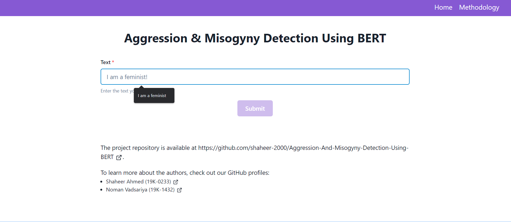
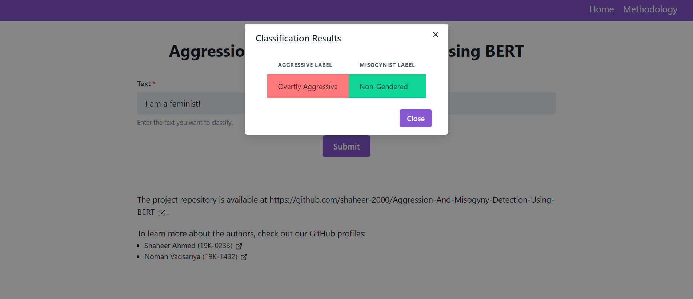
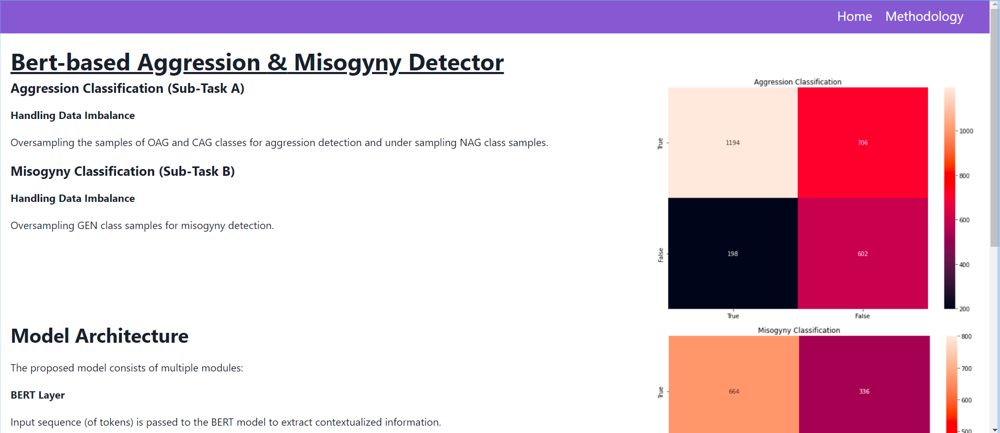

# Aggression & Misogyny Detection Using BERT

## Description

## Colaboratory Notebook
The colab notebook (.ipynb) is available at [Aggression_&_Misogyny_Detection_Using_BERT.ipynb](Aggression_&_Misogyny_Detection_Using_BERT.ipynb)

## Frontend
The frontend uses React with the CRA template and chakra-ui for its component system

## Backend
The backend uses Flask to deploy the models and allows for predictions via an API endpoint

## Screenshots
### Frontend

